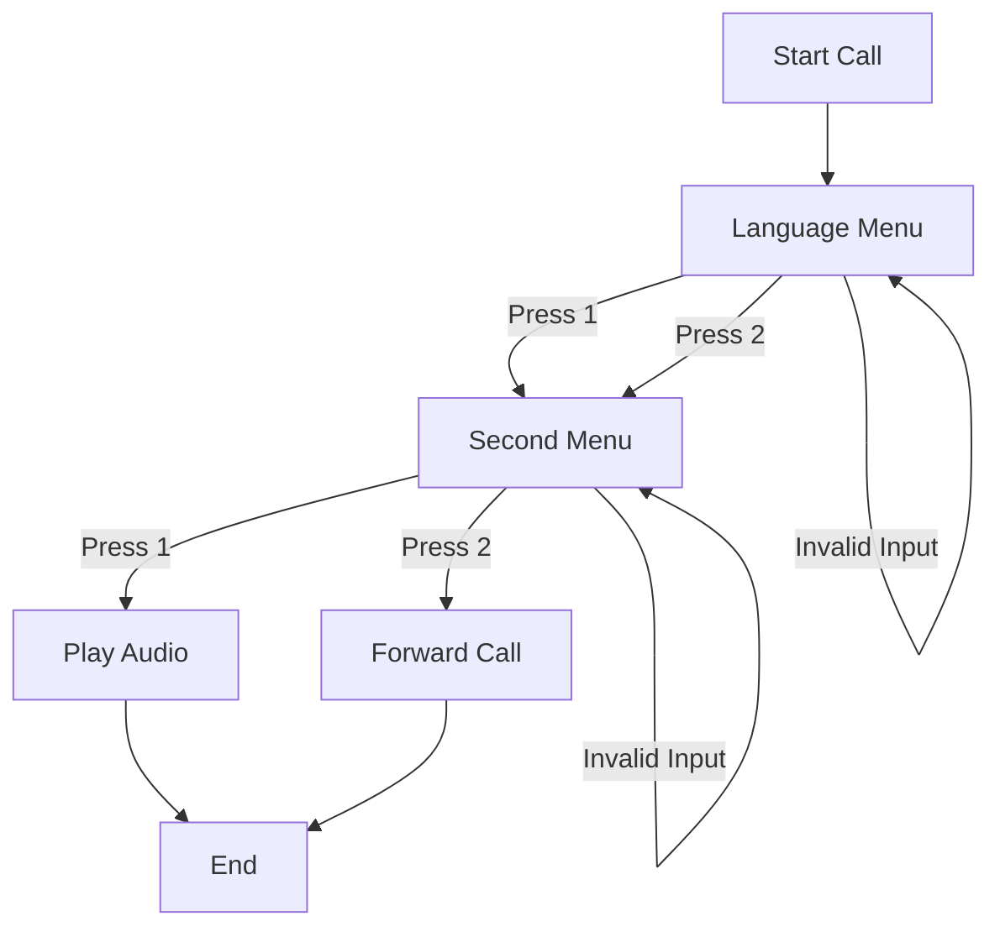

📞 Plivo IVR Demo (Forward Deployed Engineer Assignment)
========================================================

This project implements a **multi-level IVR (Interactive Voice Response) system** using:

*   **FastAPI** for backend services
    
*   **Plivo Voice API** for outbound calling + DTMF handling
    
*   **Plivo XML** for call flow control
    
*   **ngrok** for exposing local webhooks
    
*   A lightweight **HTML frontend** to trigger calls
    

The system demonstrates:

*   Outbound call initiation
    
*   Multi-level IVR menus
    
*   DTMF input handling
    
*   Audio playback
    
*   Call forwarding to an associate
    
*   A simple frontend UI to start the demo
    

✨ Features
----------

*   📞 One-click outbound call from browser UI
    
*   🌐 Language selection (Level 1 IVR)
    
*   🎧 Audio playback OR live associate routing (Level 2 IVR)
    
*   🔁 Graceful handling of invalid input
    
*   🔐 Secrets managed via .env
    
*   🎨 Minimal frontend for demo purposes

    

## 🧭 System Architecture

📞 IVR Call Flow
----------------

### Logical Flow

1.  User opens UI and clicks **Call Me**
    
2.  FastAPI triggers outbound call via Plivo
    
3.  When call is answered, Plivo hits /ivr
    
4.  Language menu is played
    
5.  User presses a digit
    
6.  Plivo routes to /menu
    
7.  Second-level options are played
    
8.  User chooses:
    
    *   Play audio
        
    *   OR forward call to associate
        

### IVR Flowchart

